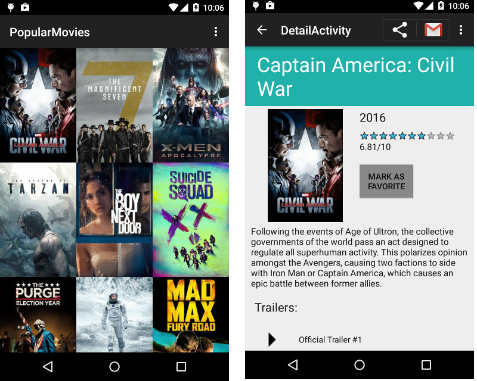

# Popular Movies App For Phone & Tablets
User Experience:
----------------
App will:
- Upon launch, present the user with an grid arrangement of movie posters.
- Allow user to change sort order via a setting:
- The sort order can be by most popular, by highest-rated or by favorite collection
- Allow the user to tap on a movie poster and transition to a details screen with additional information such as:
- original title
- movie poster image thumbnail
- A plot synopsis (called overview in the api)
- user rating (called vote_average in the api)
- release date
- movie trailers
- movie reviews
- Allow users to mark a movie as a favorite in the details view by tapping a button (This is for a local movies collection that the app will maintain and does not require an API request*.)

App screen shots:
----------------

How To Install/Run:
---------------------
Please modify following files and update API key for themoviedb.org after downloading the code.

1) File name -> app.src.main.java.com.example.richa.popularmovies.MainTaskFragment.FetchMovieDataTask
Line ->
private final String API_KEY = "";  // replace blank string with your API key

2) File name ->app.src.main.java.com.example.richa.popularmovies.TrailersReviewsTaskFragment.FetchDetailDataTask
Line ->
private final String API_KEY = ""; // replace blank string with your API key

